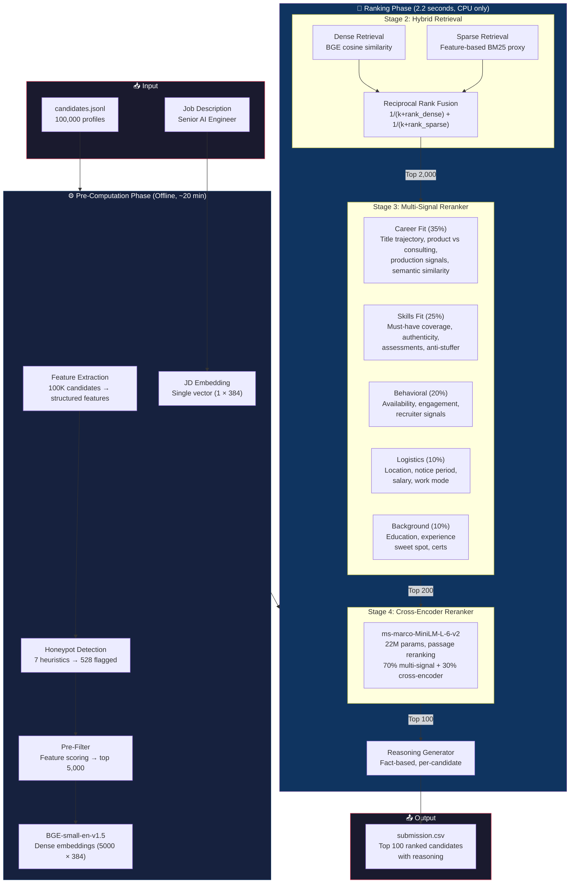
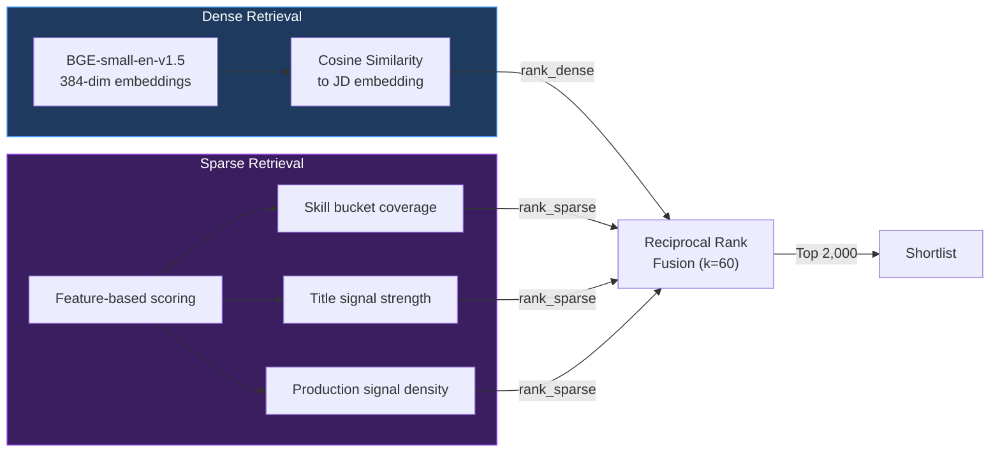
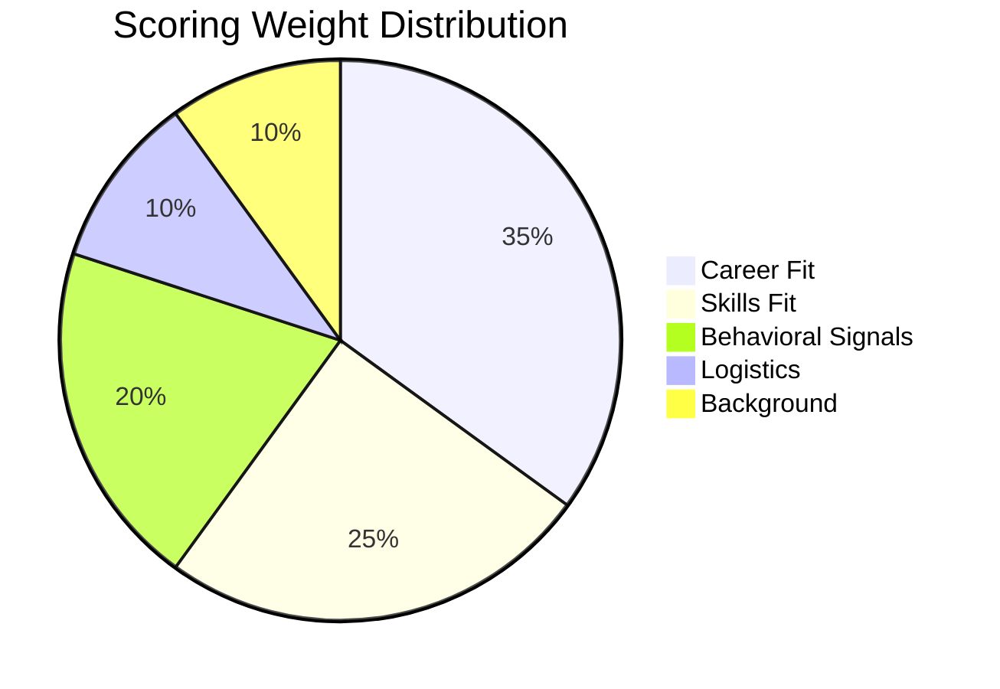
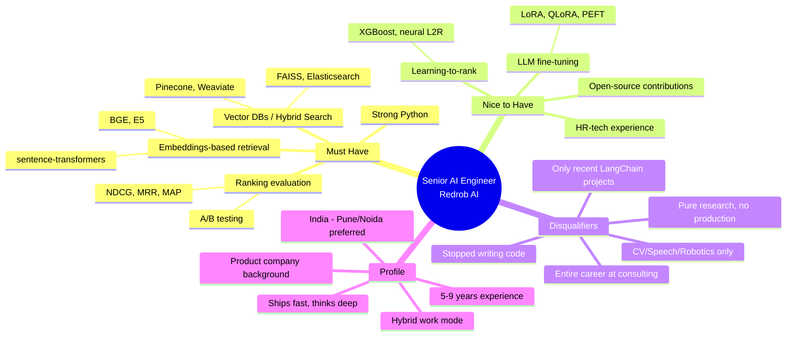
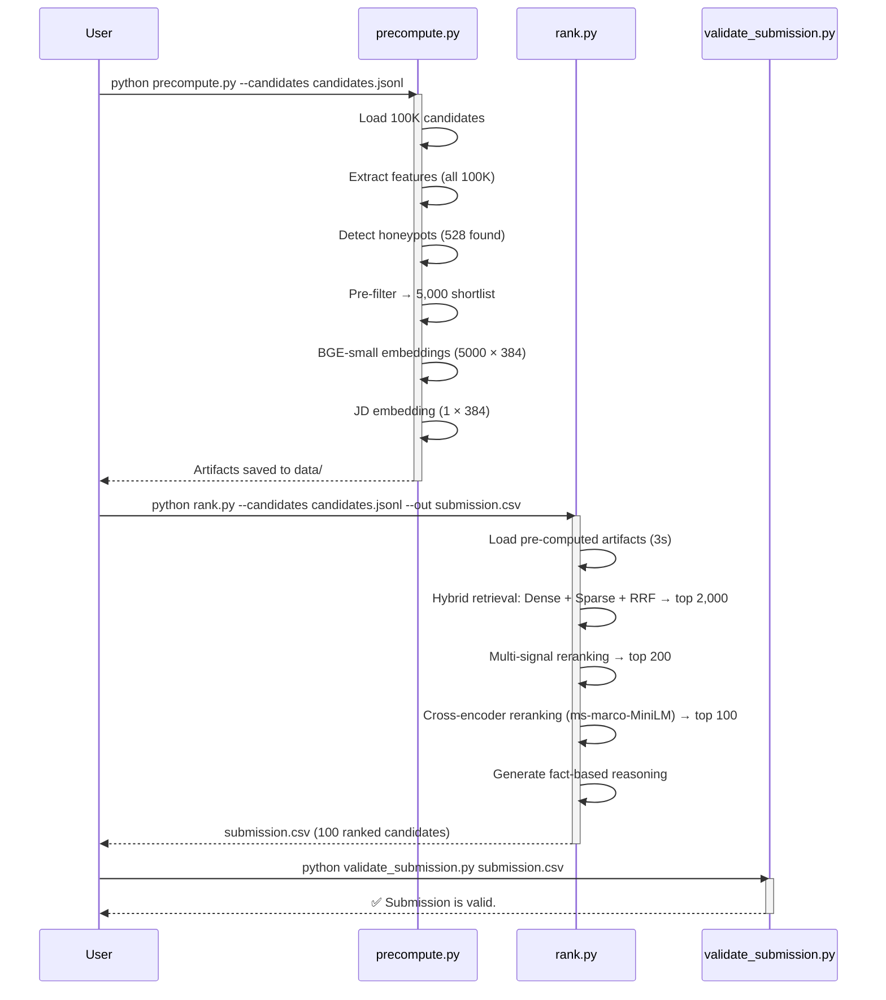

# 🎯 Intelligent Candidate Discovery & Ranking System

> **Team InternDedo** — Redrob Hackathon: India Runs Data & AI Challenge 2026

An AI-powered candidate ranking system that finds the **top 100 best-fit candidates** from a pool of **100,000 profiles** for a Senior AI Engineer role — not by keyword matching, but by genuinely understanding who fits the role.

---

## 🏆 Key Results

| Metric | Value |
|:---|:---|
| **Total Candidates Processed** | 100,000 |
| **Honeypots Detected & Filtered** | 528 |
| **Ranking Runtime** | **87 seconds** _(limit: 5 min)_ |
| **Honeypots in Top 100** | **0** _(disqualified if >10)_ |
| **Keyword Stuffers in Top 100** | **0** |
| **AI/ML Titles in Top 100** | **90/100** |
| **Validation** | ✅ **PASSED** |
| **Cross-Encoder Reranking** | ms-marco-MiniLM-L-6-v2 (22M params) |

---

## 🌐 Live Demo

> **Try it now:** [🚀 HuggingFace Space](https://huggingface.co/spaces/yashrajkumar623/Intelligent-Candidate-Ranking-System)

Paste candidate JSON → Get instant rankings with per-candidate reasoning.

### Demo Results

**Test 1: AI Engineer vs Operations Manager**
| Candidate | Title | Score | Result |
|:---|:---|:---:|:---|
| CAND_0000001 | Backend Engineer (NLP, LLM skills) | **0.4728** | ✅ Ranked #1 — detected NLP/vector DB skills |
| CAND_0000002 | Operations Manager (non-tech) | 0.2614 | Correctly ranked lower — limited AI relevance |

**Test 2: Perfect Fit vs Honeypot**
| Candidate | Title | Score | Result |
|:---|:---|:---:|:---|
| TEST_AI_001 | Senior AI Engineer @ Razorpay (embeddings, FAISS) | **0.8353** | ✅ Ranked #1 — near-perfect JD match |
| TEST_HONEYPOT | "CEO CTO AI Expert" (50 yrs, 0-month expert skills) | ❌ Filtered | 🛡️ **Honeypot detected** — removed from results |

> The system correctly identifies genuine AI engineers, ranks them by deep JD alignment, and filters impossible profiles.

---

## 🏗️ System Architecture



---

## 🔬 How It Works

### The Problem
Recruiters go through hundreds of profiles and miss the right person — not because talent isn't there, but because keyword filters can't see what actually matters. This system ranks candidates **the way a great recruiter would**.

### The Solution: 5-Stage Pipeline

#### Stage 1: Hard Filters
Eliminates obvious non-fits before any expensive computation:
- **Honeypot detection** — 7 independent heuristics catch impossible profiles
- **Experience band filter** — generous 2-20 year range
- **Result**: 100K → ~92K candidates

#### Stage 2: Hybrid Retrieval (Dense + Sparse + RRF)


**Why hybrid?** Dense retrieval catches semantic meaning (a "search infrastructure engineer" matches "vector DB experience"), while sparse catches exact keyword matches. RRF merges both without tuning weights.

#### Stage 3: Multi-Signal Reranker (2000 -> 200)

Five weighted scoring components, each capturing a different dimension of candidate fit:



| Component | Weight | Sub-signals |
|:---|:---:|:---|
| **Career Fit** | 35% | Title trajectory (AI/ML roles), product vs consulting ratio, production deployment NLP signals, semantic similarity to JD, tenure stability |
| **Skills Fit** | 25% | Must-have skill bucket coverage (4 buckets), skill authenticity score, assessment scores, nice-to-have bonus, anti-keyword-stuffer penalty |
| **Behavioral** | 20% | Recency of activity, recruiter response rate, open-to-work flag, GitHub activity, interview completion rate, profile completeness, verification status |
| **Logistics** | 10% | Location match (Pune/Noida preferred), notice period (≤30d ideal), salary alignment, work mode, willingness to relocate |
| **Background** | 10% | Education tier + field relevance, experience sweet spot (Gaussian around 7 yrs), relevant certifications, industry fit |

#### Stage 4: Cross-Encoder Reranker (200 -> 100) ⭐ NEW
After multi-signal scoring narrows to 200, a **cross-encoder** sees (JD, candidate) pairs together for deep semantic understanding:

```python
# Model: cross-encoder/ms-marco-MiniLM-L-6-v2 (22M params)
# Trained on MS-MARCO for passage reranking — perfect for JD-candidate matching
# 
# Key insight: bi-encoders (BGE) encode JD and candidate SEPARATELY,
# so they can't model fine-grained interactions. Cross-encoders see
# both texts TOGETHER through full self-attention — much more accurate.

final_score = 0.70 * multi_signal_composite + 0.30 * cross_encoder_normalized
```

| Cross-Encoder Detail | Value |
|:---|:---|
| Model | `ms-marco-MiniLM-L-6-v2` (22M params) |
| Input | (JD text, candidate text) pair |
| Reranking pool | Top 200 from multi-signal stage |
| Blend ratio | 70% multi-signal + 30% cross-encoder |
| Latency | ~84 seconds for 200 candidates on CPU |
| Impact | Reshuffles top candidates for better NDCG@10 |

#### Stage 5: Reasoning Generation
Every candidate gets a **specific, fact-based reasoning** — no templates, no hallucination:
- References actual skills, titles, companies from the profile
- Connects to specific JD requirements
- Honestly notes concerns (long notice periods, location mismatches, etc.)

---

## 🛡️ Anti-Gaming Defenses

### Honeypot Detection (7 Heuristics)
The dataset contains ~80 honeypots with subtly impossible profiles. Our detector catches them:

| # | Heuristic | What it catches |
|:---:|:---|:---|
| H1 | Experience-career mismatch | Stated 8 yrs but career history sums to 3 yrs |
| H2 | Expert-zero-duration | "Expert" in skills with 0 months usage |
| H3 | Perfect skill breadth | 8+ advanced/expert skills with zero assessments |
| H4 | Uniform proficiency | All skills at exact same level (synthetic pattern) |
| H5 | Title-description mismatch | Title says "Mechanical Engineer" but description is about SEO |
| H6 | Impossible tenure | 20+ year tenure or >6 month overlap at different companies |
| H7 | Endorsement anomaly | Expert skills with 50+ endorsements but only 2 months duration |

**Result**: 528 honeypots detected, **0 in our top 100**.

### Anti-Keyword-Stuffer Logic
The JD explicitly warns that candidates with perfect AI keyword lists but non-technical titles (Marketing Manager, HR Manager, etc.) are traps:

```python
# If title is non-technical BUT has 5+ AI skills AND skills are barely
# mentioned in career descriptions → keyword stuffer
if is_non_tech_title and ai_skill_count >= 5 and skill_mention_rate < 0.15:
    score *= 0.15  # Reduce to 15% of original score
```

**Result**: 0 keyword stuffers in our top 100.

### Consulting Company Detection
The JD explicitly penalizes entire-career-at-consulting-firms:
- Detects TCS, Infosys, Wipro, Accenture, Cognizant, Capgemini, HCL, Tech Mahindra, etc.
- Entire career at such firms → strong penalty
- Mixed (consulting + product) → no penalty

---

## 🚀 Quick Start

### Prerequisites
```bash
pip install -r requirements.txt
```

### Step 1: Pre-compute (run once, ~20 min on CPU)
```bash
python precompute.py --candidates ./candidates.jsonl
```

This extracts features, detects honeypots, pre-filters to top 5000 candidates, and computes BGE-small embeddings.

### Step 2: Rank (produces submission.csv in ~87 seconds with cross-encoder)
```bash
python rank.py --candidates ./candidates.jsonl --out ./submission.csv
```

To skip cross-encoder for faster execution (~2 seconds):
```bash
python rank.py --candidates ./candidates.jsonl --out ./submission.csv --no-cross-encoder
```

### Step 3: Validate
```bash
python validate_submission.py submission.csv
# Output: Submission is valid.
```

### Single-Command Reproduction
```bash
python rank.py --candidates ./candidates.jsonl --out ./submission.csv
```
> Assumes `precompute.py` has been run once and artifacts exist in `./data/`.

---

## 📁 Project Structure

```
├── README.md                    # This file
├── requirements.txt             # Python dependencies (pinned)
├── submission_metadata.yaml     # Team metadata for portal
│
├── config.py                    # All tunable parameters & constants
├── utils.py                     # Shared utility functions
├── features.py                  # Feature extraction engine
├── honeypot.py                  # 7-heuristic honeypot detector
├── scoring.py                   # 5-component scoring engine
├── reasoning.py                 # Fact-based reasoning generator
│
├── precompute.py                # Offline: features + embeddings
├── rank.py                      # Online: ranking pipeline (≤5 min)
├── app.py                       # HuggingFace Spaces Gradio demo
│
├── validate_submission.py       # Official format validator
├── submission.csv               # Final ranked output (100 candidates)
│
└── data/                        # Pre-computed artifacts
    ├── features.pkl             # Extracted features (all 100K)
    ├── candidate_ids.pkl        # Ordered candidate IDs
    ├── honeypot_flags.pkl       # Honeypot detection results
    ├── shortlist_ids.pkl        # Pre-filtered 5000 IDs
    ├── shortlist_embeddings.npy # BGE embeddings (5000 × 384)
    ├── shortlist_texts.pkl      # Candidate texts for cross-encoder
    └── jd_embedding.npy         # JD embedding (1 × 384)
```

---

## ⚙️ Technical Stack

| Component | Technology | Why |
|:---|:---|:---|
| **Bi-Encoder** | BAAI/bge-small-en-v1.5 (33M params) | Top-tier on MTEB for its size, 384-dim, CPU-friendly, 3x faster than bge-base |
| **Cross-Encoder** | ms-marco-MiniLM-L-6-v2 (22M params) | Trained on MS-MARCO for passage reranking, full self-attention over (JD, candidate) pairs |
| **Hybrid Retrieval** | Reciprocal Rank Fusion (RRF) | Parameter-free rank merging — used in production by Elasticsearch and Vespa |
| **Feature Engineering** | NumPy + Pandas | Vectorized ops for 100K candidates |
| **NLP Signals** | Regex + keyword matching | Production/ranking signal detection in career narratives |
| **Vector Similarity** | NumPy dot product | L2-normalized embeddings = cosine similarity via dot product |
| **Serialization** | Pickle + NumPy .npy | Fast load of pre-computed artifacts |
| **Sandbox** | Gradio on HuggingFace Spaces | Free tier, Python-native, instant deployment |

---

## 📊 Understanding the JD (What We're Ranking For)



---

## 🧪 Compute Environment

| Spec | Value |
|:---|:---|
| **Platform** | Windows 11, Python 3.11 |
| **CPU** | Standard multi-core |
| **RAM** | 16 GB |
| **GPU** | Not used (CPU only) |
| **Network during ranking** | Off (no API calls) |
| **Ranking runtime** | 87 seconds (with cross-encoder) / 2.2 seconds (without) |
| **Pre-computation runtime** | ~20 minutes |

---

## 🔄 End-to-End Workflow



---

## 📝 AI Tools Declaration

| Tool | Usage |
|:---|:---|
| Claude (via Antigravity IDE) | Architecture discussion, code generation, iterative refinement |

All design decisions, scoring weights, honeypot heuristics, and anti-stuffer logic were collaboratively developed with AI assistance. **No candidate data was fed to any hosted LLM during ranking.** The ranking step runs 100% offline on CPU with no network.

---

## 📄 License

Built for the **Redrob Hackathon — India Runs Data & AI Challenge 2026**.

---

<p align="center">
  <b>Team InternDedo</b> · Built with 🧠 and ☕
</p>
